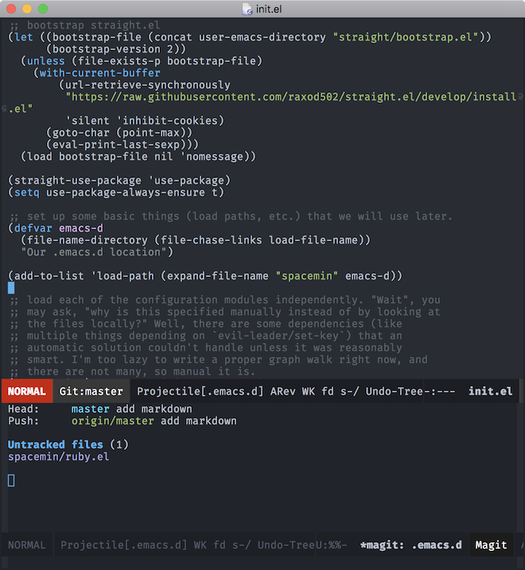

# Spacemin

A ground-up `.emacs.d` with just stuff I like from Spacemacs.
Likely not useful for anyone else.

Time for some general philosophizing: I really like Spacemacs' approach to keybindings.
Put everything under `SPC`, and all the mode-local bindings under `,` (or `SPC m`.)
I'm gonna steal all the ones I need as I need them.
If I can get them working in which-key, so much the better!

## Installing

1. Install this repo as your `.emacs.d`
2. Start emacs. Wait a while while watching the blinkenlights in the message line.
3. Probably restart it or whatever, I don't care.
4. `M-x all-the-icons-install-fonts RET yes RET`... wait a bunch.
5. You've won. Go to Disneyland?

## Things That Are Done

- evil (mostly)
- magit (mostly)
- projectile (kinda)
- looks kinda nice
- a couple languages (TBQH I don't really care about refactorings etc in `*-mode`... but syntax highlighting is nice!)
  - markdown
  - basic Ruby
  - basic Elm

But what is "done", really?

## Still To Do

### Better Keybindings

- [ ] `<SPC>1` through `9` for window jumps? (I don't frequently use these but they can be handy!)
- [ ] `]<SPC>` to insert a newline below, `[<SPC>` to insert a newline above

### Project Management

- [ ] perspectives

### Day-to-day ergonomics

- [ ] snippets (but just the auto-inserted ones... I never really use the fill-in-the-blanks ones)
- [ ] maybe a shell? I don't often use a shell but maybe if I could get zsh in there nicely...
- [ ] use spaces by default, or load editorconfig, or some other solution.
- [ ] prodigy!

### Languages

- [ ] Better Ruby / any Rails
- [ ] more fully featured Elm integration (keybindings? we don't need no steenking keybindings!)

### Appearance

- [ ] further customizations in the status line
  - [ ] make git branch not prefixed in the status line
  - [ ] call out projectile
  - [ ] diminish other minor modes
- [ ] ivy matches look weird because of the fuzzy finding (one color per character). Make this nicer.
